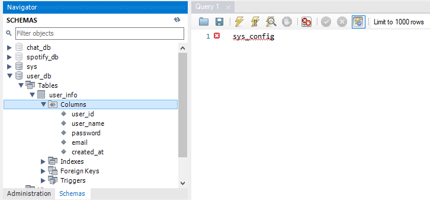

# SlackOverflow-Database

### Database Design:

### How to connect:

hostname:　database-1.ccjxezwbfect.us-east-1.rds.amazonaws.com

port: 3306

user: admin

password: slackOverflowDB

screenshot of connecting to database:

and then we can see the db:

